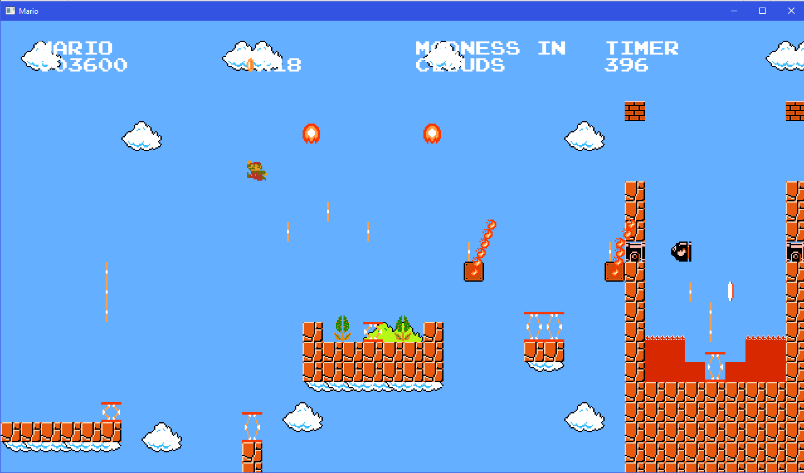
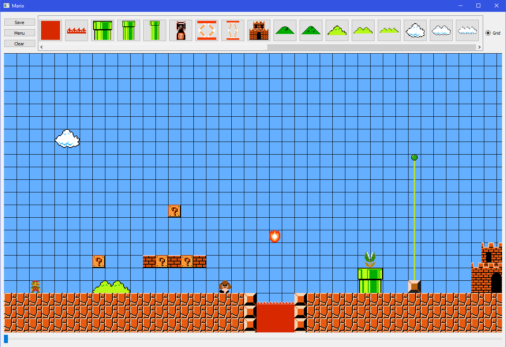
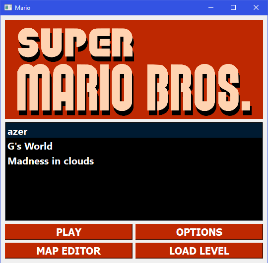
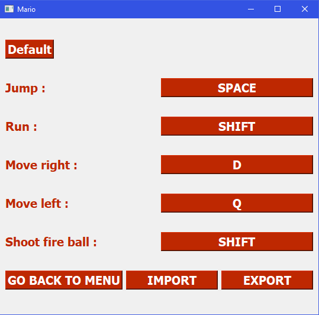

# Mario QT
## Qu'est-ce que c'est ?

Ce logiciel s'inscrit dans la réalisation du projet DI4 de C++ QT. Il a été réalisé par Guillaume Bouchard, Colin Troisemaine, Alexandre Turpin et Quentin Levieux.

Le but était de mettre en place un jeu platformer type Mario en utilisant QT et le MVC. Nous avons donc entrepris de reproduire le jeu Super Mario Bros NES.

## Installation

Le projet étant un projet QT, il est donc cross-platform. Nous recommandons l'installation de QTCreator pour la compilation du projet (Fichier -> "ouvrir un fichier ou projet" et sélectionner le Mario.Pro).

## Composition du logiciel

Le logiciel est composée de plusieurs parties, la partie principale étant le jeu en lui-même. Nous retrouvons également une gestion/éditeur de niveau au format JSON, une fenetre de configuration des touches exportables égalment au format JSON, tout cela accessible depuis le menu principal.

## Fonctionnement du jeu

Le jeu respectant le modèle MVC se voit séparé en trois parties distincte :

- Le modèle composé à la base d'ObjectModel qui représente tout les objets de notre jeux. Les objets sont alors répartis en deux catégories, les inerts (les objets ne bougeant pas) et les entités (les objets avec la fonction advance()).

- La vue composé de la classe GameView qui est un QWidget et qui va donc afficher les objets à l'écran à l'aide de Visitor (voir le design pattern).

- Le controlleur avec la classe GameController qui contient la boucle principal de notre jeux. GameController possède une liste d'objets et qui va à chaque itération de sa boucle principal (la fonction advance()) va calculer la nouvelle position des objets, vérifier qu'il n'entre pas en collision avec les autres objets, résoudre les collisions si besoin et animer l'objet. On va ensuite appeler la vue pour lui indiquer qu'il faut qu'elle repeigne sa scene.

## Screenshots du jeu

Voici quelques images du jeu :
- Le jeu :

- L'éditeur de niveaux

- Le menu principal

- Le menu d'options

